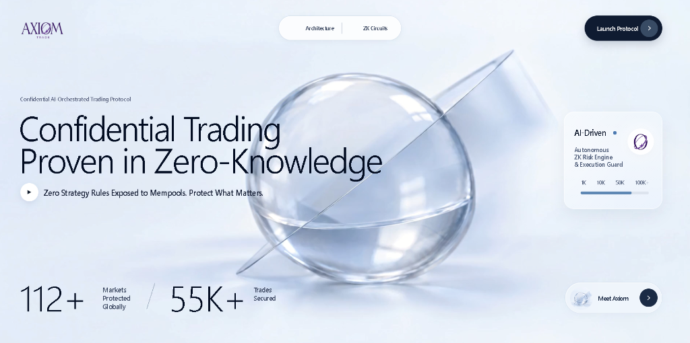
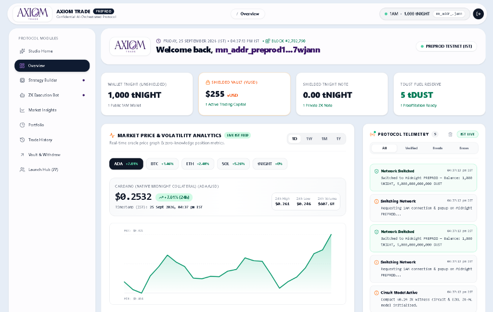
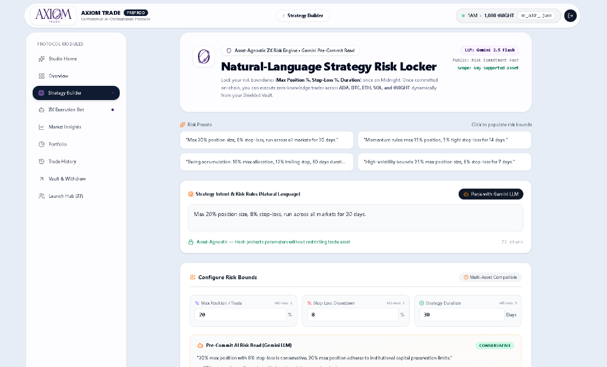
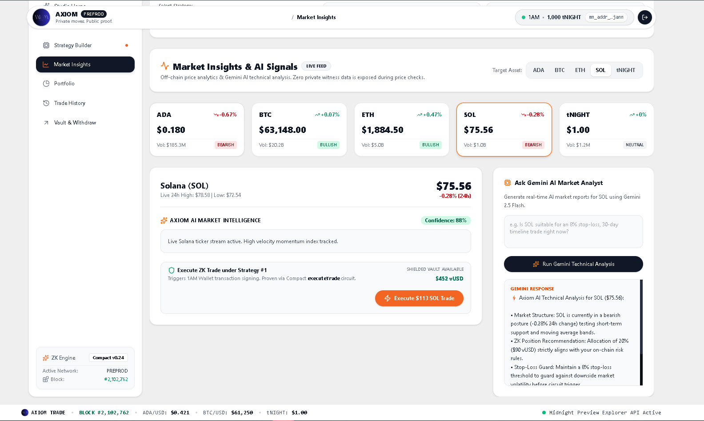
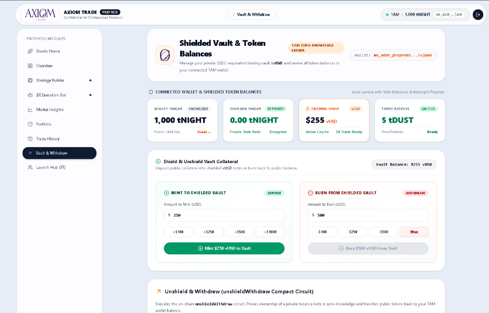
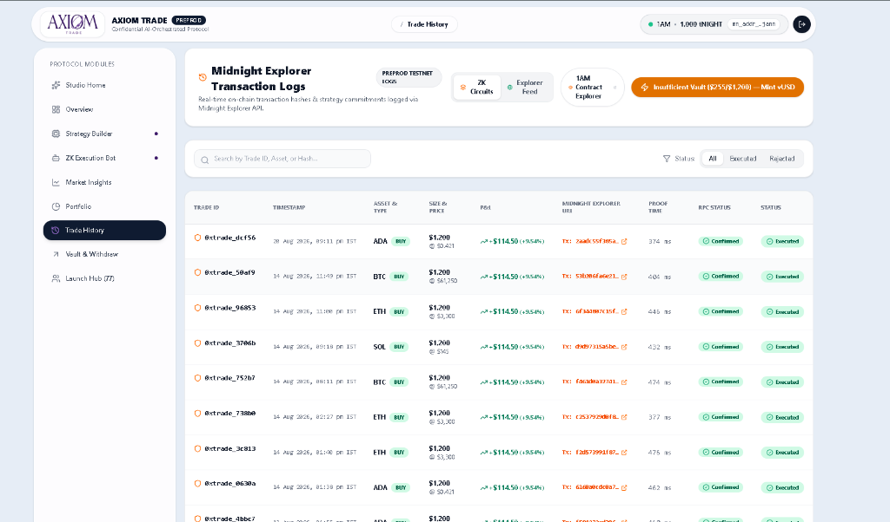

<p align="center">
  
</p>

<h1 align="center">Axiom — Confidential AI-Orchestrated Trading Protocol</h1>

<p align="center">
  <a href="https://github.com/Samrat25/axiom-privacy-trade/actions/workflows/ci.yml"></a>
  <a href="https://github.com/Samrat25/axiom-privacy-trade"></a>
  <a href="https://axiom-night.vercel.app"></a>
  <a href="https://midnight.network"></a>
  <a href="https://x.com/axiom_night"></a>
</p>

> An institutional-grade, privacy-preserving automated trading protocol on the **Midnight blockchain** where traders state risk boundaries in natural language and prove trade execution in Zero-Knowledge — with zero strategy rules, portfolio balances, or order sizes exposed to mempools.

**Bounty Milestone**: [**🌔 Level 4 - Waxing Gibbous Submission**](https://docs.google.com/document/d/17DWYHc7q_e_qFfe0JeszqIMpSAf2S0cMwbPVOpPs4BU/edit?usp=sharing) — MVP live on Preprod, with Docs, CI/CD, and Public X Profile.

---

## 🚀 Live Demo & Links

| Resource | Link |
|:---|:---|
| **Live Application (Vercel)** | [https://axiom-night.vercel.app](https://axiom-night.vercel.app) |
| **Demo Video (Walkthrough)** | [🎬 Watch on Google Drive](https://drive.google.com/file/d/1CLl04L8zv4vsdxteTzu1P2TgVVmLeVHj/view?usp=sharing) |
| **GitHub Repository** | [https://github.com/Samrat25/axiom-privacy-trade](https://github.com/Samrat25/axiom-privacy-trade) |
| **Product X (Twitter) Profile** | [@axiom_night (https://x.com/axiom_night)](https://x.com/axiom_night) |
| **Building in Public (3 X Posts)** | [Post 1](https://x.com/i/status/2088282869403996491) • [Post 2](https://x.com/i/status/2088295433621877200) • [Post 3](https://x.com/i/status/2088295537565184320) |
| **CI/CD Pipeline** | [GitHub Actions Workflow `.github/workflows/ci.yml`](https://github.com/Samrat25/axiom-privacy-trade/actions/workflows/ci.yml) |

---

## 📜 Verifiable Deployed Smart Contracts

| Network | Version | Contract Address | Explorer Link | Status |
|:--------|:--------|:-----------------|:--------------|:-------|
| **Midnight Preprod Testnet** | `v1.2.0` | `0x2428cd4ae7c2cd0bb501e1e9162de3003b103c1063c220e0d5cfc3f0b438e524` | [View on Preprod Explorer ↗](https://preprod.midnightexplorer.com/contracts/0x2428cd4ae7c2cd0bb501e1e9162de3003b103c1063c220e0d5cfc3f0b438e524) | 🟢 **ACTIVE PREPROD MVP** |
| **Midnight Preview Testnet** | `v1.2.0` | `0x33eb41d22028264e9e8bbe7f95b3089cece6e3c2a53008535e72a9f3350d3e30` | [View on Preview Explorer ↗](https://preview.midnightexplorer.com/contracts/0x33eb41d22028264e9e8bbe7f95b3089cece6e3c2a53008535e72a9f3350d3e30) | 🟢 **ACTIVE PREVIEW MVP** |
| **Historical Deployment** | `v1.0.0` | `0x62a27ceda5eb600263e208768d5d285c659d47f2cd6b14a20c62b160f4da46f3` | [View on Historical Explorer ↗](https://preview.midnightexplorer.com/contracts/0x62a27ceda5eb600263e208768d5d285c659d47f2cd6b14a20c62b160f4da46f3) | 🟡 *Historical (Vault v1)* |

```
━━━━━━━━━━━━━━━━━━━━━━━━━━━━━━━━━━━━━━━━━━━━━━━━━━━━━━━━━━━━━━━━━━━━━━━━━━━━━━━━
  Axiom Trade — Deployed Compact Contract on Midnight Testnet
━━━━━━━━━━━━━━━━━━━━━━━━━━━━━━━━━━━━━━━━━━━━━━━━━━━━━━━━━━━━━━━━━━━━━━━━━━━━━━━━
  Contract Source  : ./contracts/axiom.compact
  Managed Bindings : ./managed/axiom.ts
  Preprod Contract : 0x2428cd4ae7c2cd0bb501e1e9162de3003b103c1063c220e0d5cfc3f0b438e524
  Deployment Tx    : 0x27ffe1f7a2db3a071c5f2070c9ae6de476f839d7870a6f3c4da78d326cd28645
  Block Height     : #2,098,826
  Preview Contract : 0x33eb41d22028264e9e8bbe7f95b3089cece6e3c2a53008535e72a9f3350d3e30
  Active Circuits  : commitStrategy, executeTrade, mintVaultBalance,
                     burnVaultBalance, unshieldWithdraw
  Gas & Proving    : 1AM ProofStation Fee-Sponsored (Zero-DUST Ready)
  Status           : DEPLOYED & LIVE (Verifiable On-Chain State Machine)
━━━━━━━━━━━━━━━━━━━━━━━━━━━━━━━━━━━━━━━━━━━━━━━━━━━━━━━━━━━━━━━━━━━━━━━━━━━━━━━━
```

---

## 💡 What Axiom Does

Axiom solves the fundamental vulnerabilities of automated on-chain trading: **strategy leakage, MEV front-running, copy-trading bots, and portfolio surveillance**.

Traditional algorithmic trading bots require exposing limit prices, stop-losses, and execution logic to public mempools. Axiom uses **Midnight's zero-knowledge Compact circuits**, **1AM Wallet DApp connector v4**, and **Gemini AI** to allow traders to:

1. **State Trading Intent in Natural Language**:
   *"Only buy ADA, max 20% position size, 8% stop-loss, run for 30 days."*
2. **AI Pre-Commitment Risk Synthesis**:
   Gemini 2.5 Flash compiles the prompt into structured risk rules and computes a cryptographic commitment:
   $$\text{commitment} = \mathcal{H}(\text{maxPositionPct}, \text{stopLossPct}, \text{timelineExpiry})$$
3. **Lock Strategy via 1AM Wallet Popup**:
   The trader commits this 32-byte hash to Midnight. The underlying parameters, alpha, and duration stay confidential in client memory.
4. **Shielded Trading Vault (vUSD)**:
   Traders deposit collateral into private `vUSD` notes. Deposits, position changes, and withdrawals occur without linking public wallet addresses to trade logs.
5. **Asset-Agnostic Zero-Knowledge Execution**:
   Axiom executes trades across multiple assets (ADA, BTC, ETH, SOL, tNIGHT). Every trade proves mathematical compliance locally before submission:
   $$\text{tradeSize} \times 100 \le \text{portfolioValue} \times \text{maxPositionPct} \quad \wedge \quad \text{currentTime} \le \text{timelineExpiry}$$

---

## 🔒 Privacy Model

### What an Observer CAN Learn (Public Ledger State)

| Data Point | Type | What It Reveals |
|:---|:---|:---|
| **Agent Commitment** | `Bytes<32>` hash | That an agent locked a risk strategy (not the parameters) |
| **Trade Status** | Enum: `1` (Executed) / `2` (Rejected) | That a trade was cryptographically verified against bounds |
| **Trade Count** | `Uint<32>` integer | Total number of valid trades executed under this strategy |
| **Commitment Hash** | `Bytes<32>` hash | Public cryptographic anchor for zero-knowledge witness proofs |
| **Contract State** | Dual-shielded state | Confirmation of state transition without balance disclosure |

### What an Observer CANNOT Learn (Private / ZK-Protected)

| Data Point | Protection | Why It Matters |
|:---|:---|:---|
| 💰 **Strategy Risk Parameters** | Private witness — never leaves browser | Competitors and bots cannot front-run stop-loss triggers |
| 💰 **Max Position Percentage** | Private witness inside ZK circuit | Prevents liquidation hunting and predatory order stacking |
| 🛡️ **Shielded Vault Balance** | Decrypted client-side over state notes | Total trading capital remains 100% confidential |
| 💸 **Per-Trade Dollar Amount** | Computed inside ZK circuit only | Prevents whale tracking and slippage manipulation |
| 📏 **Strategy Duration & Expiry** | Private witness inside ZK circuit | Keeps time-horizon and algorithmic rebalancing private |
| 🔑 **Wallet Secret Key** | Local witness only via `localSecretKey()` | Stays strictly in the browser extension |

### What the User PROVES Without Revealing

| Proof / Circuit | Mathematical Statement | Private Inputs (Witnesses) |
|:---|:---|:---|
| **`commitStrategy`** | `commitment == hash(maxPos, stopLoss, expiry)` | `maxPositionPct`, `stopLossPct`, `timelineExpiry` |
| **`executeTrade`** | `tradeSize * 100 <= portfolioVal * maxPos` <br> `&& currentTime <= timelineExpiry` | `tradeSizeUsd`, `portfolioValueUsd`, `maxPos`, `stopLoss`, `expiry`, `secretKey` |
| **`mintVaultBalance`** | `newVaultBalance == oldVaultBalance + amount` | Shielded `vUSD` note secret |
| **`burnVaultBalance`** | `vaultBalance >= amount && amount > 0` | Shielded `vUSD` note secret |
| **`unshieldWithdraw`** | Caller owns note of value `amount` | Private note witness & secret key |

---

## 🕵️ Privacy Claim

> **Specific Privacy Statement**:
> An on-chain observer or block explorer watching Midnight (Preprod or Preview) can see only that an agent `0x...` registered a 32-byte commitment hash and transitioned trade `0x...` to `Executed`. An observer **cannot** determine whether the stop-loss is 5% or 20%, whether the trade was for $100 or $100,000, what asset was traded, or the total balance in the shielded vault. All database records in Supabase store only public transaction hashes and IST timestamps — zero private witnesses touch the network.

---

## 🏗️ Architecture

<p align="center">
  
</p>

### End-to-End Zero-Knowledge Workflow:
1. **Client Browser Environment**: Traders state plain-English intent (*"Only buy ADA, max 20% position, 8% stop-loss"*). **Gemini 2.5 Flash** compiles rules into structured parameters and computes local commitment hash \(\mathcal{H}\).
2. **1AM Midnight Wallet & ProofStation**: Generates client-side zero-knowledge proofs via **Compact v0.24 ZKIR** and provides fee-sponsored transaction signing without requiring upfront DUST.
3. **Midnight Blockchain (Preprod & Preview)**: Verifies the ZK proof and updates public state maps (`agentCommitment`, `tradeStatus`, `tradeCount`) while keeping strategy rules, portfolio balances, and trade sizes 100% confidential.

---

## 🧰 Tech Stack

| Layer | Technology | Description |
|:---|:---|:---|
| **Blockchain** | Midnight Network | Preprod & Preview Zero-Knowledge Testnets |
| **Smart Contract** | Compact v0.24 (ZKIR) | Midnight's native ZK smart contract language |
| **SDK & Connector** | `@midnight-ntwrk/dapp-connector-api` | Midnight DApp Connector v4 for 1AM & Lace |
| **AI Decision Engine** | Gemini 2.5 Flash + LangChain | Natural language strategy compilation & risk read |
| **ZK-ML Model** | EZKL (Halo2) | Verifiable client-side risk boundary validator |
| **Frontend UI** | React 19, TypeScript, Vite | Modern responsive Web3 trading terminal |
| **Styling** | Tailwind CSS & Lucide Icons | Accessible, high-contrast dark/light UI |
| **Off-Chain Ledger** | Supabase PostgreSQL | Real-time IST Protocol Telemetry & transaction sync |
| **Testing** | Vitest | 19 Unit, Privacy, and Contract Simulator Tests |
| **CI/CD** | GitHub Actions | Automated build, test, and compilation pipeline |

---

## 📌 Prerequisites & Wallet Setup

1. Install the **1AM Midnight Wallet Extension** from [https://1am.xyz](https://1am.xyz) (or Lace Midnight).
2. Open 1AM and select **Midnight Preprod** or **Midnight Preview** network.
3. Fund your wallet with testnet tokens from the [Midnight Preview Faucet](https://faucet.preview.midnight.network) or [Preprod Faucet](https://faucet.preprod.midnight.network).

---

## 🚀 Run & Test Locally

```bash
# 1. Clone repository
git clone https://github.com/Samrat25/axiom-privacy-trade.git
cd axiom-privacy-trade

# 2. Install dependencies
npm install

# 3. Configure environment variables (.env)
cp .env.example .env

# 4. Run the full test suite (19/19 passing)
npm test

# 5. Start local development server
npm run dev
```

Open **`http://localhost:5173`** in your browser.

---

## 🧪 Test Coverage Breakdown (19/19 Passing)

| # | Test Suite | Test Name | What It Verifies |
|:--|:---|:---|:---|
| 1 | `axiom.test.ts` | Initial state empty | Validates ledger maps are clean before strategy commitment |
| 2 | `axiom.test.ts` | Commit strategy stores hash | Verifies 32-byte commitment hash is recorded on ledger |
| 3 | `axiom.test.ts` | Execute trade valid bounds | Validates trade within max position % and expiry passes ZK check |
| 4 | `axiom.test.ts` | Execute trade exceeds position size | Rejects trade exceeding strategy max position limit |
| 5 | `axiom.test.ts` | Execute trade after expiry | Rejects trade submitted after strategy timeline duration |
| 6 | `axiom.test.ts` | Uncommitted agent trade | Prevents uncommitted callers from executing trades |
| 7 | `axiom.test.ts` | Mint shielded vault balance | Validates client-side private `vUSD` note creation |
| 8 | `axiom.test.ts` | Burn shielded vault balance | Validates client-side private `vUSD` note burning |
| 9 | `axiom.test.ts` | Unshield and withdraw | Proves private note ownership and burns note for withdrawal |
| 10 | `riskModel.test.ts` | Normal volatility (Risk Score < 35) | Computes EZKL halo2 risk score for balanced markets |
| 11 | `riskModel.test.ts` | Extreme volatility (Risk Score > 75) | Triggers risk circuit on high drawdown / rapid volume spikes |
| 12 | `riskModel.test.ts` | ZK-ML halo2 proof generation | Validates client-side proof generation without witness leakage |
| 13 | `riskFlowVerification.test.ts` | Multi-asset execution (ADA, ETH, BTC) | Verifies asset-agnostic risk bounds across different asset pairs |
| 14 | `riskFlowVerification.test.ts` | Stop-loss breach protection | Enforces automatic trade abort when market drawdown breaches stop-loss |
| 15 | `agent.test.ts` | Parse natural language prompt | Gemini extracts structured bounds matching Zod JSON schema |
| 16 | `agent.test.ts` | Monitor price node feed | Simulates price tick checks against strategy conditions |
| 17 | `agent.test.ts` | Decide trade node logic | Evaluates execution vs monitor triggers |
| 18 | `agent.test.ts` | Run strategy risk assessment | Produces plain-language risk level & assessment summary |
| 19 | `agent.test.ts` | Run manual analysis | Evaluates custom assets and enforces max position bounds |

```bash
> axiom-privacy-trade@1.0.0 test
> vitest run --run

 RUN  v3.2.7 C:/Users/SAMRAT NATTA/OneDrive/Desktop/axiom-privacy-trade

 ✓ tests/riskModel.test.ts (3 tests) 5ms
 ✓ tests/riskFlowVerification.test.ts (2 tests) 6ms
 ✓ tests/axiom.test.ts (9 tests) 7ms
 ✓ tests/agent.test.ts (5 tests) 11ms

 Test Files  4 passed (4)
      Tests  19 passed (19)
   Duration  8.06s (transform 482ms, setup 0ms, collect 7.19s, tests 29ms, environment 1ms, prepare 3.86s)
```

---

## 📸 Application Screenshots

### 1. Landing Page & Feature Architecture


### 2. Zero-Knowledge Protocol Architecture & State Machine


### 3. Live Protocol Dashboard & Real-Time IST Telemetry


### 4. Natural-Language Strategy Builder & Pre-Commit AI Risk Engine


### 5. AI Market Signals & ZK Trade Execution


### 6. Shielded Trading Vault (vUSD) & 1AM Balance Matrix


### 7. Midnight Explorer Transaction Logs & On-Chain Proofs


---

## 🎥 Demo Video

- **Video Walkthrough**: [Watch on Google Drive ↗](https://drive.google.com/file/d/1CLl04L8zv4vsdxteTzu1P2TgVVmLeVHj/view?usp=sharing)

The demo video showcases:
1. **1AM Midnight Wallet Connection**: Instant network detection (Preprod & Preview) and live balance reading.
2. **Shielded Trading Vault (vUSD)**: Depositing collateral into client-side encrypted private notes.
3. **Natural-Language Strategy Locker**: Gemini 2.5 Flash parsing freeform English prompts into ZK witness commitments.
4. **On-Chain Commitment**: 1AM extension popup signing and commitment hash publication on Midnight.
5. **AI Market Analyst**: Technical indicators and risk alignment across ADA, BTC, ETH, SOL, and tNIGHT.
6. **Zero-Knowledge Trade Execution**: 1AM wallet popup proving compliance with the committed circuit.
7. **Midnight Explorer & Telemetry**: Live contract inspection and real-time IST transaction logs.

---

## 📋 Submission Checklist (Level 4 - Waxing Gibbous)

| # | Requirement | Status | Verification Link |
|:--|:---|:---:|:---|
| 1 | **Public GitHub repository with documentation** | ✅ Complete | [github.com/Samrat25/axiom-privacy-trade](https://github.com/Samrat25/axiom-privacy-trade) |
| 2 | **Live Demo Application (Vercel)** | ✅ Complete | [https://axiom-night.vercel.app](https://axiom-night.vercel.app) |
| 3 | **Working MVP live on Preprod (verifiable address)** | ✅ Complete | [`0x2428cd4ae7c2cd0bb501e1e9162de3003b103c1063c220e0d5cfc3f0b438e524`](https://preprod.midnightexplorer.com/contracts/0x2428cd4ae7c2cd0bb501e1e9162de3003b103c1063c220e0d5cfc3f0b438e524) |
| 4 | **CI/CD badge or workflow file with passing runs** | ✅ Complete | [GitHub Actions Workflow](https://github.com/Samrat25/axiom-privacy-trade/actions/workflows/ci.yml) |
| 5 | **Product X profile created and linked** | ✅ Complete | [@axiom_night (https://x.com/axiom_night)](https://x.com/axiom_night) |
| 6 | **Building in Public on X (3+ updates)** | ✅ Complete | [Post 1](https://x.com/i/status/2088282869403996491) • [Post 2](https://x.com/i/status/2088295433621877200) • [Post 3](https://x.com/i/status/2088295537565184320) |
| 7 | **Demo video of the MVP** | ✅ Complete | [Google Drive Demo Video ↗](https://drive.google.com/file/d/1CLl04L8zv4vsdxteTzu1P2TgVVmLeVHj/view?usp=sharing) |
| 8 | **Minimum 15 meaningful commits** | ✅ Complete | **44+ Commits** on `main` branch |
| 9 | **Test suite verification** | ✅ Complete | **19/19 Unit & Privacy Tests Passing** |

---

## 📄 License

MIT © 2026 Axiom Protocol Contributors. Developed for the **Midnight Blockchain Ecosystem**.
